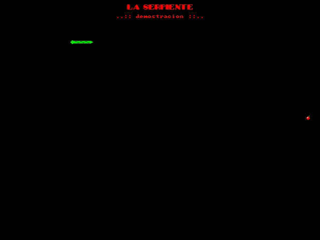

# serpiente



_Serpiente_ is a simple game inspired by the snake games on old Nokia phones.

This is the first hobby project I wrote after learning C++ at the University.  The Game's interface and the identifiers
in the source code are all in Spanish, because I just started learning that language at the time.


## Building

### Ubuntu

Install dependencies:
```
sudo apt install \
    g++ \
    liballegro4-dev \
    make \
    pkg-config \
```

Build using `make`:
```
make
```


### Docker

The repo contains a `Dockerfile`, which can be used to build the project.  The result binaries need to be extracted
from the image.  This can all be done automatically using the script:
```
./build.sh
```

The script also extracts the required allegro shared library, so it doesn't need to be installed using `apt`.

_Note: this was only tested on Ubuntu 20.04_
